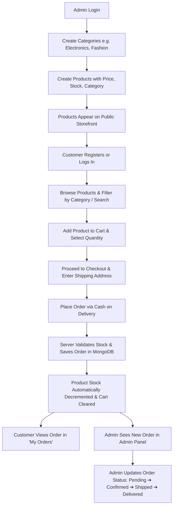

# Mini E-Commerce Platform (MERN Stack)

A lightweight, modern, and production-grade **Mini E-Commerce Demo Application** built with the **MERN Stack** (MongoDB, Express.js, React.js, Node.js), styled with **Tailwind CSS**, and bundled with **Vite**.

Designed with strict separation of concerns, robust security practices, role-based JWT authentication, transactional stock integrity, and clean responsive UI/UX across mobile, tablet, and desktop devices.

---

## 📑 Table of Contents

- [Tech Stack](#-tech-stack)
- [Project Architecture & Directory Structure](#-project-architecture--directory-structure)
- [Core Features](#-core-features)
  - [1. Authentication & Roles](#1-authentication--roles)
  - [2. Public Storefront](#2-public-storefront)
  - [3. Shopping Cart & Inventory Safety](#3-shopping-cart--inventory-safety)
  - [4. Checkout & Order Placement (Cash on Delivery)](#4-checkout--order-placement-cash-on-delivery)
  - [5. Admin Dashboard](#5-admin-dashboard)
- [Main Demo Flow](#-main-demo-flow)
- [MongoDB Data Models](#-mongodb-data-models)
- [REST API Endpoints](#-rest-api-endpoints)
- [Validation & Security Architecture](#-validation--security-architecture)
- [UI/UX Specifications](#-uiux-specifications)
- [Documentation Index](#-documentation-index)
- [Local Development Setup](#-local-development-setup)

---

## 🚀 Tech Stack

| Layer | Technology | Description |
| :--- | :--- | :--- |
| **Frontend** | React 18+ (JavaScript) | Declarative component-driven user interface |
| **Bundler & Tooling** | Vite | Ultra-fast local development server & optimized builds |
| **Styling** | Tailwind CSS | Modern utility-first responsive styling system |
| **Icons & Notifications** | Lucide React / React Hot Toast | Clean UI icons and non-blocking toast notifications |
| **HTTP Client** | Axios | Configured with interceptors for JWT token injection |
| **Backend** | Node.js + Express.js | Fast, minimalist REST API server |
| **Database** | MongoDB + Mongoose ODM | Document-oriented database with schema validation |
| **Authentication** | JSON Web Tokens (JWT) + bcryptjs | Stateless auth with salt-hashed passwords |

---

## 📂 Project Architecture & Directory Structure

The project is structured into two clean, self-contained sub-applications:

```text
mini-ecommerce-mern/
├── client/                     # React + Vite Frontend
│   ├── public/                 # Static assets & favicon
│   ├── src/
│   │   ├── assets/             # Brand logos & imagery
│   │   ├── components/         # Shared & reusable UI components
│   │   │   ├── common/         # Navbar, Footer, Modal, Toast, Loader, EmptyState
│   │   │   ├── admin/          # AdminSidebar, StatCard, OrderStatusBadge
│   │   │   └── product/        # ProductCard, ProductGrid, CategoryFilter
│   │   ├── context/            # React Context Providers (AuthContext, CartContext)
│   │   ├── hooks/              # Custom React hooks (useAuth, useCart)
│   │   ├── layouts/            # MainLayout (Storefront), AdminLayout (Dashboard)
│   │   ├── pages/              # Routed view components
│   │   │   ├── Home.jsx
│   │   │   ├── Products.jsx
│   │   │   ├── ProductDetails.jsx
│   │   │   ├── Cart.jsx
│   │   │   ├── Checkout.jsx
│   │   │   ├── Login.jsx
│   │   │   ├── Register.jsx
│   │   │   ├── MyOrders.jsx
│   │   │   └── admin/          # Admin view components
│   │   │       ├── Dashboard.jsx
│   │   │       ├── Categories.jsx
│   │   │       ├── Products.jsx
│   │   │       └── Orders.jsx
│   │   ├── services/           # Axios API service modules (api.js, authService, etc.)
│   │   ├── utils/              # Formatters (currency, date) & constants
│   │   ├── App.jsx             # Route definitions & layout wrappers
│   │   ├── main.jsx            # React root DOM mounting
│   │   └── index.css           # Tailwind CSS directives
│   ├── index.html
│   ├── package.json
│   ├── tailwind.config.js
│   └── vite.config.js
│
├── server/                     # Node.js + Express Backend
│   ├── src/
│   │   ├── config/             # DB connection & environment constants
│   │   ├── controllers/        # Request handlers (auth, category, product, order)
│   │   ├── middlewares/        # JWT auth, admin authorization, error handling
│   │   ├── models/             # Mongoose schemas (User, Category, Product, Order)
│   │   ├── routes/             # Express route routers
│   │   ├── utils/              # Token generators & custom API error classes
│   │   └── server.js           # Express app bootstrap & listener
│   ├── .env.example            # Sample environment variables
│   └── package.json
│
├── docs/                       # Project Specifications & Documentation
│   ├── ARCHITECTURE.md         # High-level architecture & data flows
│   ├── API_SPECIFICATION.md    # Exhaustive REST API contract
│   ├── DATABASE_MODELS.md      # Detailed Mongoose schemas & indexes
│   ├── FRONTEND_SPECIFICATION.md # UI/UX, Component trees & state design
│   └── IMPLEMENTATION_GUIDE.md # Step-by-step phased execution plan
│
├── .gitignore                  # Git exclusions for node_modules, .env, build outputs
└── README.md                   # Master project README
```

---

## 🌟 Core Features

### 1. Authentication & Roles
- **Customer Registration & Login**: User registration with Name, Email, Password, Confirm Password.
- **Admin Authentication**: Privileged login unlocking administrative capabilities.
- **Security Primitives**: Passwords salted and hashed with `bcryptjs` (min 10 salt rounds). JWT stateless tokens with expiration.
- **Protected Middleware**: Express middleware verifies token integrity (`protect`) and restricts admin routes (`adminOnly`).

### 2. Public Storefront
- **Responsive Navigation**: Brand logo, search bar, category shortcuts, Cart icon with badge counter, and Auth status dropdown.
- **Category Filtering & Search**: Instant filtering by category pills (e.g. `All | Electronics | Fashion | Shoes`) and case-insensitive keyword search.
- **Product Catalog Grid**: Responsive card grid with product image, title, price, category tag, inventory status, and direct "Add to Cart" action.
- **Product Details View**: Comprehensive item overview displaying stock availability, description, image, and quantity selection.

### 3. Shopping Cart & Inventory Safety
- **Cart Management**: Add items, increase/decrease quantities, or remove items.
- **Stock Boundary Protection**: Frontend and backend enforce quantity limits so customers cannot order more than current stock.
- **Live Price Subtotal**: Instant real-time subtotal calculation.

### 4. Checkout & Order Placement (Cash on Delivery)
- **Payment Method**: Standardized strictly on **Cash on Delivery (COD)**.
- **Shipping Address Details**: Validated fields for Full Name, Phone Number, Street Address, City, and Postal Pincode.
- **Server-Side Price & Stock Verification**: Never trust the price or stock calculation from client-side payloads. When placing an order, the server fetches current product prices directly from MongoDB, verifies available stock, decrements stock atomically, and clears the user's cart upon success.
- **Customer Order Tracking**: "My Orders" page displays previous orders, delivery address, order items, timestamps, and live statuses (`Pending`, `Confirmed`, `Shipped`, `Delivered`, `Cancelled`).

### 5. Admin Dashboard
- **Category Management**: Add, view, edit, and delete product categories.
- **Product Catalog Management**: Add, view, edit, and delete products (Name, Description, Price, Image URL, Category, Stock) with delete confirmation dialogs.
- **Order Oversight**: View all customer orders across the platform, inspect customer shipping details and items, and update order fulfillment statuses.

---

## 🔄 Main Demo Flow

The end-to-end user journey is designed as follows:



---

## 🗄️ MongoDB Data Models

The system enforces strict schema definitions for exactly **four core entities**:

1. **User**: Name, Email (unique), Password (hashed), Role (`customer` or `admin`), Timestamps.
2. **Category**: Name (unique, trimmed), Description, Timestamps.
3. **Product**: Name, Description, Price (positive number), Image URL, Category reference (`ObjectId` pointing to `Category`), Stock (non-negative integer), Timestamps.
4. **Order**: User reference (`ObjectId` pointing to `User`), Products list (`product`, `name`, `quantity`, `price`), Total Amount, Shipping Address (`name`, `phone`, `address`, `city`, `pincode`), Status (`Pending`, `Confirmed`, `Shipped`, `Delivered`, `Cancelled`), CreatedAt.

*Refer to [docs/DATABASE_MODELS.md](docs/DATABASE_MODELS.md) for full schema definitions.*

---

## 🔌 REST API Endpoints

### Authentication
- `POST /api/auth/register` - Register a new customer
- `POST /api/auth/login` - Authenticate customer or admin & return JWT token

### Categories
- `GET /api/categories` - Fetch all categories (Public)
- `POST /api/categories` - Create a new category (Admin)
- `PUT /api/categories/:id` - Update category details (Admin)
- `DELETE /api/categories/:id` - Delete category (Admin)

### Products
- `GET /api/products` - List products with filter support: `?category=electronics&search=phone` (Public)
- `GET /api/products/:id` - Get single product details (Public)
- `POST /api/products` - Create new product (Admin)
- `PUT /api/products/:id` - Update product details (Admin)
- `DELETE /api/products/:id` - Delete product (Admin)

### Orders
- `POST /api/orders` - Place a new order with stock validation (Customer)
- `GET /api/orders/my-orders` - Retrieve authenticated user's order history (Customer)
- `GET /api/admin/orders` - Retrieve all store orders (Admin)
- `PATCH /api/admin/orders/:id/status` - Update order delivery status (Admin)

*Refer to [docs/API_SPECIFICATION.md](docs/API_SPECIFICATION.md) for complete payload and response contracts.*

---

## 🛡️ Validation & Security Architecture

1. **Input Validation**:
   - Mandatory fields checked across both client forms and server controllers.
   - Email format validation with regex matching.
   - Minimum 6 characters for passwords; confirmation match check.
   - Price must be strictly greater than 0; stock must be an integer $\ge 0$.
2. **Server-Authoritative Pricing**:
   - Order total is **never** calculated using prices passed from client request bodies.
   - The backend looks up the canonical product price in MongoDB at the exact moment of order placement.
3. **Atomic Stock Decrement**:
   - Products are validated against live inventory before order creation. Stock is decremented concurrently or within a safe transaction to avoid overselling.
4. **JWT Security**:
   - Tokens signed with server-side secret key; transmitted in HTTP `Authorization: Bearer <token>` header.
   - Role-based authorization middleware gates administrative endpoints.

---

## 🎨 UI/UX Specifications

- **Design Philosophy**: Modern, minimalist, accessible, and uncluttered.
- **Component Primitives**:
  - Reusable Product Cards with hover effects.
  - Sticky responsive top Navbar with mobile hamburger menu.
  - Collapsible Sidebar for the Admin Dashboard.
  - Interactive Filter Tabs (`All | Electronics | Fashion | Shoes`).
  - Modal confirmation dialog for destructive actions (e.g. deleting product or category).
  - Toast notifications for user feedback (e.g. "Item added to cart", "Order placed successfully").
  - Skeleton loaders and empty states when items or orders are missing.

*Refer to [docs/FRONTEND_SPECIFICATION.md](docs/FRONTEND_SPECIFICATION.md) for UI designs and screen layouts.*

---

## 📚 Documentation Index

Detailed architectural and design specifications are organized in the `/docs` directory:

| Document | Purpose |
| :--- | :--- |
| **[docs/ARCHITECTURE.md](docs/ARCHITECTURE.md)** | System topology, sequence flows, auth lifecycle, and data flow |
| **[docs/API_SPECIFICATION.md](docs/API_SPECIFICATION.md)** | Request/response schemas, error codes, and headers for all endpoints |
| **[docs/DATABASE_MODELS.md](docs/DATABASE_MODELS.md)** | Mongoose schemas, constraints, field types, and relationships |
| **[docs/FRONTEND_SPECIFICATION.md](docs/FRONTEND_SPECIFICATION.md)** | Component structure, route tables, Tailwind theme, and state flows |
| **[docs/IMPLEMENTATION_GUIDE.md](docs/IMPLEMENTATION_GUIDE.md)** | Step-by-step phased execution plan for development |

---

## ⚙️ Local Development Setup

When ready to begin coding, follow the steps below:

### Prerequisites
- Node.js (v18.x or v20.x recommended)
- MongoDB (Local instance or MongoDB Atlas URI)
- Git

### 1. Server Setup (`/server`)
```bash
cd server
npm install
cp .env.example .env
npm run dev
```

Sample `.env`:
```env
PORT=5000
MONGO_URI=mongodb://localhost:27017/mini-ecommerce
JWT_SECRET=your_jwt_super_secret_key_12345
ADMIN_EMAIL=admin@example.com
ADMIN_PASSWORD=adminpassword123
```

### 2. Client Setup (`/client`)
```bash
cd client
npm install
npm run dev
```

Access the frontend at `http://localhost:5173` and backend API at `http://localhost:5000`.
