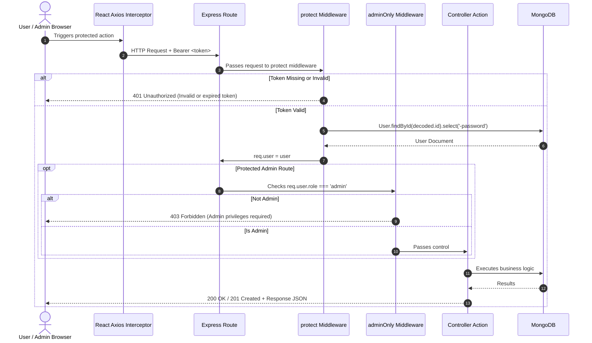
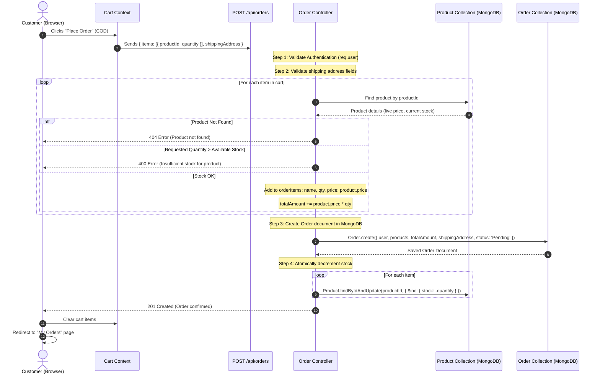

# System Architecture & Technical Design

This document details the architectural design, security mechanisms, data flows, and subsystem interactions of the **Mini E-Commerce MERN Stack Platform**.

---

## 🏛️ High-Level System Architecture

The platform follows a decoupled, three-tier client-server architecture:

```mermaid
graph TD
    subgraph ClientLayer ["Client Layer (React + Vite + Tailwind)"]
        UI[Public Storefront Pages & Admin Dashboard]
        State[React Context / Hooks (Auth, Cart)]
        AxiosClient[Axios HTTP Client + Interceptors]
        UI --> State
        State --> AxiosClient
    end

    subgraph APILayer ["Backend Server (Node.js + Express)"]
        Router[Express Route Handlers]
        AuthMW[Auth Middleware (JWT Verify)]
        AdminMW[Admin Guard Middleware]
        Controllers[Controller Business Logic]
        ErrorHandler[Centralized Error Handling]
        
        Router --> AuthMW
        AuthMW --> AdminMW
        AdminMW --> Controllers
        Controllers --> ErrorHandler
    end

    subgraph DataLayer ["Persistence Layer (MongoDB + Mongoose)"]
        MUser[(User Collection)]
        MCat[(Category Collection)]
        MProd[(Product Collection)]
        MOrder[(Order Collection)]
    end

    AxiosClient -- "REST Requests (JSON + Bearer Token)" --> Router
    Controllers -- "Mongoose Queries & Transactions" --> MUser
    Controllers --> MCat
    Controllers --> MProd
    Controllers --> MOrder
```

---

## 🔐 Authentication & Authorization Lifecycle

Authentication is stateless and implemented using **JSON Web Tokens (JWT)** and **bcryptjs**.

### Token Generation & Structure
- **Payload**:
  ```json
  {
    "id": "64f1a2b3c4d5e6f7a8b9c0d1",
    "role": "customer",
    "email": "customer@example.com",
    "iat": 1727856000,
    "exp": 1728460800
  }
  ```
- **Lifespan**: Typically 7 days.
- **Client Storage**: Token is stored in `localStorage` upon successful login/register.
- **Client Transmission**: Attached to every outgoing Axios request using the `Authorization` header:
  ```http
  Authorization: Bearer <jwt_token>
  ```

### Auth & Role Middleware Flow



---

## 📦 Order Placement & Inventory Safety Flow

A critical business requirement is **Never Trust Client Prices** and **Prevent Overselling**. The order placement flow strictly adheres to server-side canonical data:



---

## 🌐 State Management Design (Frontend)

The frontend separates server synchronization from local UI state:

1. **`AuthContext`**:
   - `user`: Holds current logged-in user details (`{ id, name, email, role }`).
   - `token`: JWT string.
   - `isAuthenticated`: Boolean derived from presence of valid token.
   - `isAdmin`: Boolean derived from `user.role === 'admin'`.
   - Actions: `login(email, password)`, `register(formData)`, `logout()`.

2. **`CartContext`**:
   - `cartItems`: Array of cart objects `[{ product: { _id, name, price, image, stock }, quantity }]`.
   - `totalPrice`: Derived memoized sum `items.reduce(...)`.
   - `totalItems`: Derived count of all items in cart.
   - Actions: `addToCart(product, quantity)`, `removeFromCart(productId)`, `updateQuantity(productId, quantity)`, `clearCart()`.
   - **Persistence**: Synced with `localStorage.getItem('cart')` to survive page reloads.
   - **Boundary Enforcement**: Cannot increment beyond `product.stock`.

---

## 🛡️ Centralized Error Handling & Validation

### Express Error Pipeline
All asynchronous controller functions are wrapped in an `asyncHandler` utility to forward unhandled errors to the global error middleware:

```javascript
// Centralized Error Response Format
{
  "success": false,
  "message": "Specific human-readable error description",
  "errors": ["Optional list of field-level validation errors"]
}
```

### HTTP Status Code Conventions
- `200 OK`: Request succeeded.
- `201 Created`: Resource successfully created (User registered, Product/Category added, Order created).
- `400 Bad Request`: Input validation failed, password mismatch, or insufficient stock.
- `401 Unauthorized`: Missing or malformed JWT token.
- `403 Forbidden`: Authenticated user lacks admin permissions.
- `404 Not Found`: Requested resource ID does not exist.
- `500 Internal Server Error`: Unhandled server exception.
