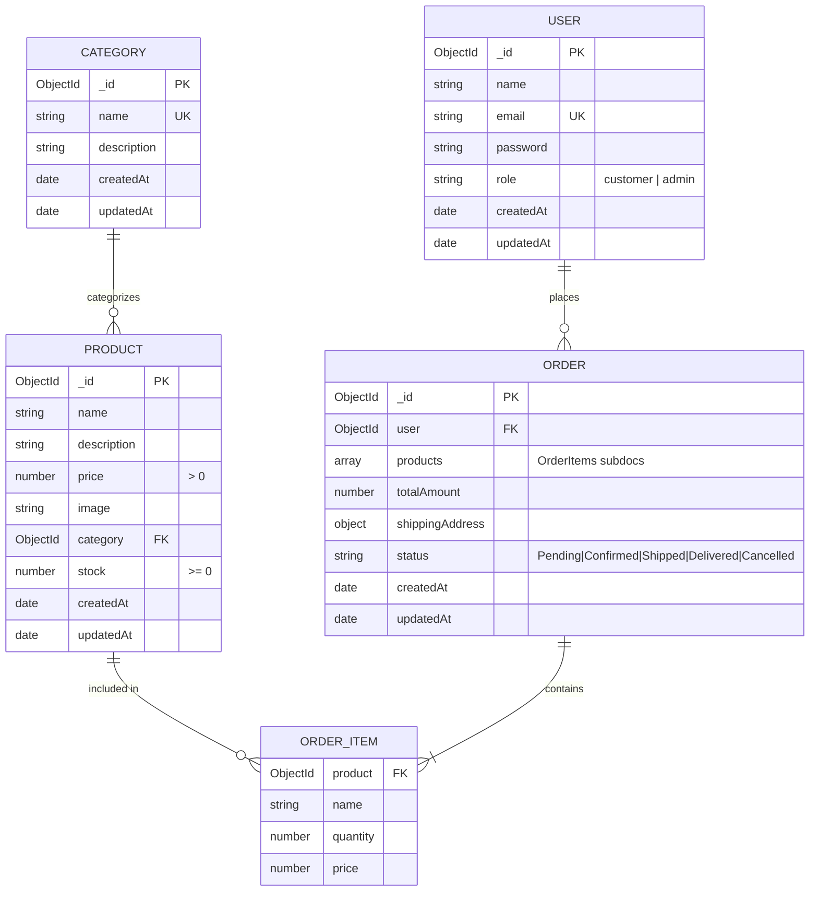

# MongoDB Data Models & Schema Design

The application persists data using **MongoDB** managed through **Mongoose ODM**. Exactly four models are defined to ensure a lean, robust architecture.

---

## 📊 Entity Relationship Diagram (ERD)



---

## 1. User Model (`models/User.js`)

Stores credentials and role privileges for customers and platform administrators.

### Schema Definition
```javascript
import mongoose from 'mongoose';
import bcrypt from 'bcryptjs';

const userSchema = new mongoose.Schema(
  {
    name: {
      type: String,
      required: [true, 'Name is required'],
      trim: true,
      maxlength: [50, 'Name cannot exceed 50 characters']
    },
    email: {
      type: String,
      required: [true, 'Email is required'],
      unique: true,
      lowercase: true,
      trim: true,
      match: [
        /^\w+([\.-]?\w+)*@\w+([\.-]?\w+)*(\.\w{2,3})+$/,
        'Please provide a valid email address'
      ]
    },
    password: {
      type: String,
      required: [true, 'Password is required'],
      minlength: [6, 'Password must be at least 6 characters'],
      select: false // Avoid returning password hash in query projections
    },
    role: {
      type: String,
      enum: ['customer', 'admin'],
      default: 'customer'
    }
  },
  {
    timestamps: true
  }
);

// Mongoose Pre-save Hook for Password Hashing
userSchema.pre('save', async function (next) {
  if (!this.isModified('password')) return next();
  const salt = await bcrypt.genSalt(10);
  this.password = await bcrypt.hash(this.password, salt);
  next();
});

// Instance Method to Compare Passwords
userSchema.methods.matchPassword = async function (enteredPassword) {
  return await bcrypt.compare(enteredPassword, this.password);
};

export default mongoose.model('User', userSchema);
```

---

## 2. Category Model (`models/Category.js`)

Organizes the catalog into distinct product classifications (e.g., Electronics, Fashion, Shoes).

### Schema Definition
```javascript
import mongoose from 'mongoose';

const categorySchema = new mongoose.Schema(
  {
    name: {
      type: String,
      required: [true, 'Category name is required'],
      unique: true,
      trim: true,
      maxlength: [40, 'Category name cannot exceed 40 characters']
    },
    description: {
      type: String,
      trim: true,
      default: ''
    }
  },
  {
    timestamps: true
  }
);

// Index for high-performance lookup
categorySchema.index({ name: 1 });

export default mongoose.model('Category', categorySchema);
```

---

## 3. Product Model (`models/Product.js`)

Manages the product catalog, imagery, canonical pricing, inventory counts, and category links.

### Schema Definition
```javascript
import mongoose from 'mongoose';

const productSchema = new mongoose.Schema(
  {
    name: {
      type: String,
      required: [true, 'Product name is required'],
      trim: true,
      maxlength: [120, 'Product name cannot exceed 120 characters']
    },
    description: {
      type: String,
      required: [true, 'Product description is required'],
      trim: true
    },
    price: {
      type: Number,
      required: [true, 'Product price is required'],
      min: [0.01, 'Price must be greater than zero']
    },
    image: {
      type: String,
      required: [true, 'Product image URL is required'],
      trim: true
    },
    category: {
      type: mongoose.Schema.Types.ObjectId,
      ref: 'Category',
      required: [true, 'Valid category reference is required']
    },
    stock: {
      type: Number,
      required: [true, 'Stock count is required'],
      min: [0, 'Stock cannot be negative'],
      default: 0
    }
  },
  {
    timestamps: true
  }
);

// Indexes for search and category filtering
productSchema.index({ category: 1 });
productSchema.index({ name: 'text', description: 'text' });

export default mongoose.model('Product', productSchema);
```

---

## 4. Order Model (`models/Order.js`)

Records customer orders placed via Cash on Delivery, locking in canonical item prices at the time of purchase.

### Schema Definition
```javascript
import mongoose from 'mongoose';

const orderItemSchema = new mongoose.Schema(
  {
    product: {
      type: mongoose.Schema.Types.ObjectId,
      ref: 'Product',
      required: true
    },
    name: {
      type: String,
      required: true
    },
    quantity: {
      type: Number,
      required: true,
      min: [1, 'Quantity must be at least 1']
    },
    price: {
      type: Number,
      required: true
    }
  },
  { _id: false }
);

const shippingAddressSchema = new mongoose.Schema(
  {
    name: {
      type: String,
      required: [true, 'Full name is required'],
      trim: true
    },
    phone: {
      type: String,
      required: [true, 'Phone number is required'],
      trim: true
    },
    address: {
      type: String,
      required: [true, 'Street address is required'],
      trim: true
    },
    city: {
      type: String,
      required: [true, 'City is required'],
      trim: true
    },
    pincode: {
      type: String,
      required: [true, 'Pincode is required'],
      trim: true
    }
  },
  { _id: false }
);

const orderSchema = new mongoose.Schema(
  {
    user: {
      type: mongoose.Schema.Types.ObjectId,
      ref: 'User',
      required: true
    },
    products: {
      type: [orderItemSchema],
      required: true,
      validate: {
        validator: (items) => Array.isArray(items) && items.length > 0,
        message: 'Order must contain at least one product'
      }
    },
    totalAmount: {
      type: Number,
      required: true,
      min: [0.01, 'Total order amount must be greater than zero']
    },
    shippingAddress: {
      type: shippingAddressSchema,
      required: true
    },
    status: {
      type: String,
      enum: ['Pending', 'Confirmed', 'Shipped', 'Delivered', 'Cancelled'],
      default: 'Pending'
    },
    createdAt: {
      type: Date,
      default: Date.now
    }
  },
  {
    timestamps: true
  }
);

// Indexes for querying customer orders and admin dashboards
orderSchema.index({ user: 1, createdAt: -1 });
orderSchema.index({ status: 1 });

export default mongoose.model('Order', orderSchema);
```
