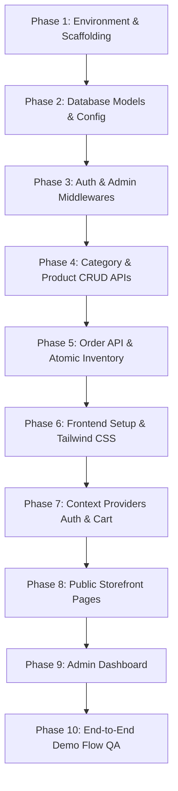

# Phased Implementation Roadmap & Verification Plan

This document serves as the tactical roadmap for implementing the **Mini E-Commerce MERN Stack Platform**. It is structured in sequential phases to ensure smooth integration, security compliance, and comprehensive verification.

---

## 🎯 Phased Development Roadmap



---

## Phase 1: Environment & Scaffolding
- Initialize root workspace structure with `/client` and `/server`.
- Set up root `.gitignore` to protect credentials (`.env`), build artifacts, and `node_modules`.
- Configure `server/package.json` with scripts:
  - `"start": "node src/server.js"`
  - `"dev": "nodemon src/server.js"`
- Set up dependencies: `express`, `mongoose`, `dotenv`, `cors`, `jsonwebtoken`, `bcryptjs`.

---

## Phase 2: Database Models & Config
- Create `server/src/config/db.js` using Mongoose connection pooling.
- Create Mongoose models:
  - `User.js`: email uniqueness, password hashing pre-save hook, role enum.
  - `Category.js`: name indexing and validation.
  - `Product.js`: positive price constraint, non-negative stock constraint, Category `ObjectId` reference.
  - `Order.js`: embedded order items, shipping address schema, status enum (`Pending`, `Confirmed`, `Shipped`, `Delivered`, `Cancelled`).

---

## Phase 3: Authentication & Middleware Layer
- Implement `generateToken(userId, role)` utility with `jsonwebtoken`.
- Create Auth controller:
  - `register`: Validates password confirmation, checks uniqueness, hashes password, saves user.
  - `login`: Matches password using `user.matchPassword()`, returns user object + token.
- Implement middlewares:
  - `protect`: Extracts Bearer token from headers, verifies token, attaches `req.user`.
  - `adminOnly`: Rejects requests if `req.user.role !== 'admin'`.

---

## Phase 4: Category & Product APIs
- **Category API**:
  - `GET /api/categories`: Public list of categories.
  - `POST /api/categories`: Admin only creation.
  - `PUT /api/categories/:id`: Admin only update.
  - `DELETE /api/categories/:id`: Admin only deletion.
- **Product API**:
  - `GET /api/products`: Public retrieval supporting `?category=...&search=...`.
  - `GET /api/products/:id`: Public single product lookup.
  - `POST /api/products`: Admin creation.
  - `PUT /api/products/:id`: Admin update.
  - `DELETE /api/products/:id`: Admin deletion.

---

## Phase 5: Orders & Inventory Management
- **Order Placement (`POST /api/orders`)**:
  - Extract `items` and `shippingAddress` from request.
  - Loop through items to fetch live canonical price and verify `stock >= requestedQuantity`.
  - If any product has insufficient stock, abort with `400 Bad Request`.
  - Compute total server-side amount.
  - Create `Order` document with status `'Pending'`.
  - Atomically decrement product stock: `Product.findByIdAndUpdate(id, { $inc: { stock: -quantity } })`.
- **Customer Orders (`GET /api/orders/my-orders`)**:
  - Retrieve authenticated user's orders sorted by `createdAt: -1`.
- **Admin Orders (`GET /api/admin/orders`) & Status Patch (`PATCH /api/admin/orders/:id/status`)**:
  - List all platform orders with populated user and product details.
  - Update status (`Pending` ➔ `Confirmed` ➔ `Shipped` ➔ `Delivered` ➔ `Cancelled`).

---

## Phase 6: Frontend Setup & Tailwind CSS
- Scaffold React client via Vite:
  ```bash
  npm create vite@latest client -- --template react
  ```
- Install Tailwind CSS, PostCSS, and Autoprefixer.
- Install client dependencies: `react-router-dom`, `axios`, `react-hot-toast`, `lucide-react`.
- Configure base Axios instance with request interceptor for JWT authorization header.

---

## Phase 7: State Management & Route Protection
- Implement `AuthContext.jsx`:
  - `user`, `token`, `login`, `register`, `logout`.
  - Persist credentials in `localStorage`.
- Implement `CartContext.jsx`:
  - `cartItems`, `addToCart`, `updateQuantity`, `removeFromCart`, `clearCart`.
  - Guard quantity from exceeding `product.stock`.
  - Persist items in `localStorage`.
- Implement Route Guards:
  - `ProtectedRoute`: Redirects unauthenticated visitors to `/login`.
  - `AdminRoute`: Redirects non-admin users to `/`.

---

## Phase 8: Public Storefront Implementation
- Build responsive `Navbar` and `Footer`.
- Build `Home.jsx` with category shortcuts and featured products.
- Build `Products.jsx` with search bar, category pill tabs (`All | Electronics | Fashion | Shoes`), and responsive product card grid.
- Build `ProductDetails.jsx` with full description and stock-capped quantity selector.
- Build `Cart.jsx` with real-time totals and quantity adjustment.
- Build `Checkout.jsx` with COD form validation and order placement handler.
- Build `MyOrders.jsx` displaying customer order cards and delivery progress.

---

## Phase 9: Admin Dashboard Implementation
- Build `AdminLayout.jsx` with navigation sidebar.
- Build `Dashboard.jsx` with quick store overview.
- Build `Categories.jsx` with add/edit modal and delete confirmation dialog.
- Build `Products.jsx` with product management modal and delete confirmation dialog.
- Build `Orders.jsx` with order details and status change dropdown.

---

## Phase 10: Complete Demo Flow Verification Checklist

| Step | Action | Expected Result | Pass/Fail |
| :---: | :--- | :--- | :---: |
| 1 | Admin Login | Admin authenticated and redirected to `/admin` | ⬜ |
| 2 | Add Category | New category appears in Admin table and Public filter pills | ⬜ |
| 3 | Add Product | New product created with price, stock, and category | ⬜ |
| 4 | Public Storefront Sync | Product is immediately visible on `/products` | ⬜ |
| 5 | Filter & Search | Filtering by category and searching by keyword displays correct item | ⬜ |
| 6 | Customer Registration | New customer registers and is auto logged in | ⬜ |
| 7 | Add to Cart | Item added to cart; quantity cannot exceed stock | ⬜ |
| 8 | Checkout & COD | Order placed with shipping address; cart is cleared | ⬜ |
| 9 | Inventory Reduction | Product stock decreases in MongoDB and on storefront | ⬜ |
| 10 | Order Oversight & Status | Customer sees order in "My Orders"; Admin sees order and updates status | ⬜ |
